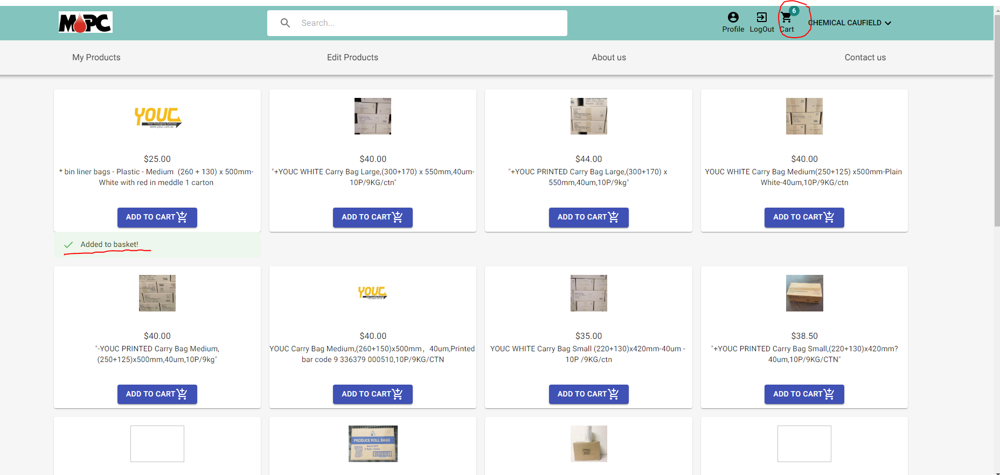

# User Documentation
 

## Login System
The site requires customers/admins to login before being able to view or make any changes with products.
User will need to have an account to gain certain permissions to the website, or can register for one if they don't have  

## Store Switch
After login, user will be able to see their registered store, and able to navigate between store to see different products customised for each of their store.  

## My Products
My products page shows all products that user had added to their current store. My products page will be different depend on with current store they are choosing  

In this page, user can add whichever products they want to the basket. The added products will be applied for the current store they are choosing. 

After adding product to basket, the product will be in the basket. User can open their current shopping basket by clicking the shopping bag icon on the top right of their screen.  

A cart drawer will appear and show all products added. User can change quantity or proceed to checkout from here. Click 'Confirm Order' in order to proceed to the checkout page.

## Edit Products
Users can edit product name in order to serve their own customisation purposes.  

To do so, click on the Edit button, after that, change the product name to whatever prefered, then click the green button to save edit.  

## Contact
User can find extra information about the store under 'About Us' or 'Contact Us' tab through the navigation bar
